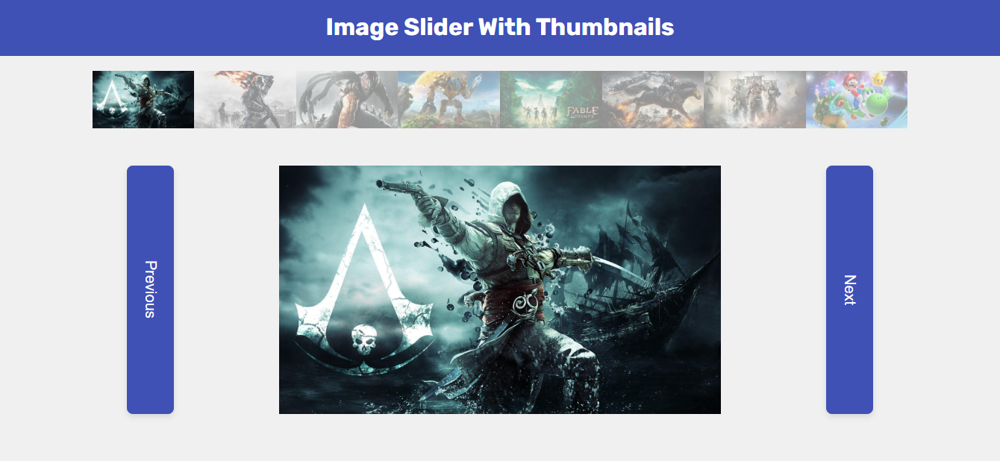

# 🖼️ Image Slider With Thumbnails  

🌐 **Live Demo:** [View Project](https://amelchenni.github.io/Image-Slider-With-Thumbnails/)  

---

## 📖 Description  
This project is an **interactive image slider** with clickable thumbnails.  
Users can navigate between images using thumbnails or previous/next buttons. The current image’s thumbnail is always highlighted, ensuring a smooth and clear user experience.  

---

## 🚀 Features  
- Clickable thumbnails to display the main image.  
- Previous and Next navigation buttons.  
- Highlight effect on the active thumbnail.  
- Responsive layout for different screen sizes.  

---

## 🛠️ Technologies Used  
- **HTML5** – Structure  
- **CSS3** – Styling & Layout  
- **JavaScript (Vanilla)** – Functionality & Interactivity  

---

## 📷 Preview  
  

---

## 📌 Future Improvements  
- Add **autoplay** with adjustable interval.  
- Enable **swipe navigation** for mobile devices.  
- Add smooth **transition effects** (fade/slide).  
- Improve **accessibility** with keyboard navigation & ARIA support.  

---

## ▶️ Usage  
1. Clone this repository:  
   ```bash
   git clone https://github.com/AmelChenni/Image-Slider-With-Thumbnails.git
